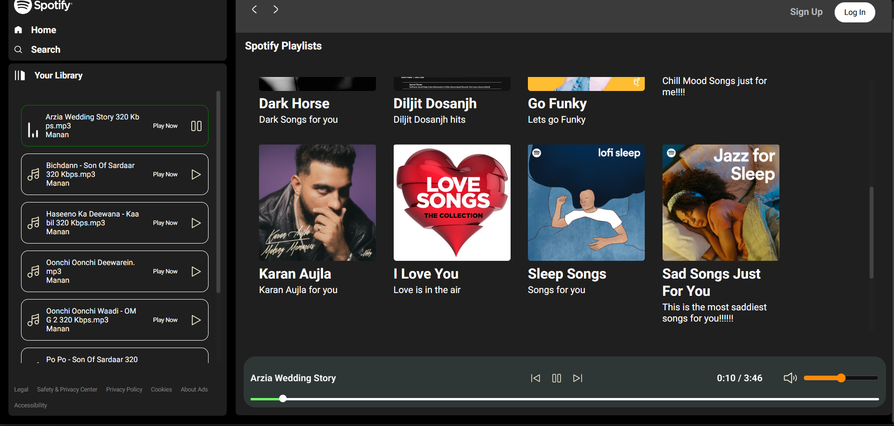

# Spotify Clone

This project includes only HTML, CSS, and JavaScript.

## Features of this clone

The features of this project are as follows:

1. Seek Bar representing the duration of the song.
2. Volume button for controlling the volume of the song.
3. Previous and next buttons for playing the previous and next songs displayed in the list of songs.
4. Dynamic album loading: as the user clicks on an album, the list of songs will be loaded in the playlist shown on the left of the application.

## Screenshots

